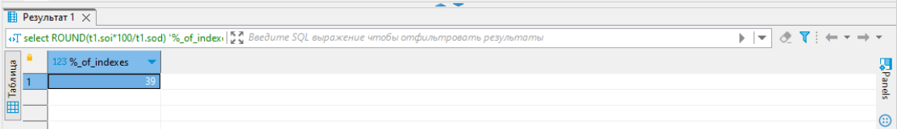
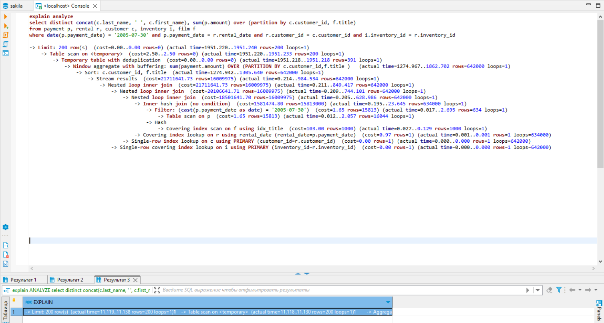
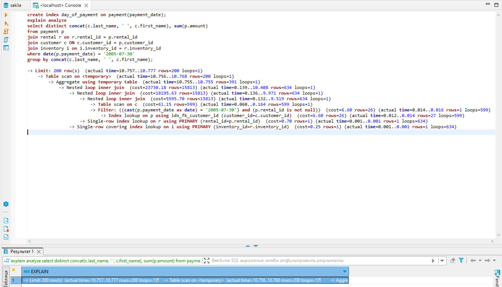

# Домашнее задание к занятию «Индексы»

### Задание 1

Напишите запрос к учебной базе данных, который вернёт процентное отношение общего размера всех индексов к общему размеру всех таблиц.

### Ответ:

```sql
 select ROUND(t1.soi*100/t1.sod) '%_of_indexes'
 from (
  select SUM(data_length) sod, SUM(index_length) soi
  from INFORMATION_SCHEMA.TABLES) t1;
```



---

### Задание 2

Выполните explain analyze следующего запроса:

```sql
select distinct concat(c.last_name, ' ', c.first_name), sum(p.amount) over (partition by c.customer_id, f.title)
from payment p, rental r, customer c, inventory i, film f
where date(p.payment_date) = '2005-07-30' and p.payment_date = r.rental_date and r.customer_id = c.customer_id and i.inventory_id = r.inventory_id
```

### Ответ:



- перечислите узкие места;

Наблюдаю узкие места при использовании оконных функций OVER и PARTITION BY, а так же в момент фильтрации вывода, в сравнении колонок из разных таблиц.

- оптимизируйте запрос: внесите корректировки по использованию операторов, при необходимости добавьте индексы. Так же избыточная таблица - film.

```sql
create index day_of_payment on payment(payment_date);
select distinct concat(c.last_name, ' ', c.first_name), sum(p.amount) 
from payment p
join rental r on r.rental_id = p.rental_id 
join customer c ON c.customer_id = p.customer_id 
join inventory i on i.inventory_id = r.inventory_id 
where date(p.payment_date) = '2005-07-30' 
group by concat(c.last_name, ' ', c.first_name); 
```



---
